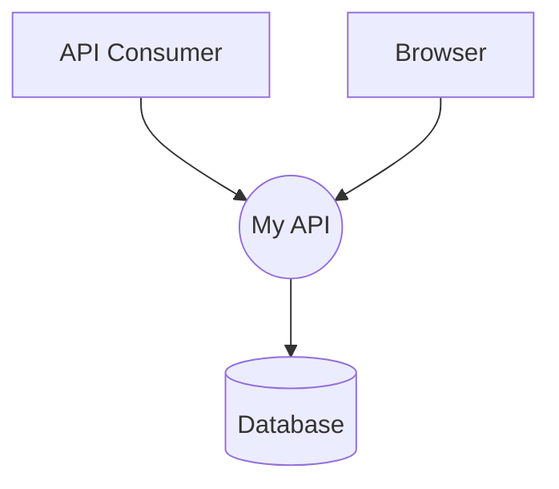

# Threat Model

Securing an application is hard. If it were easy, we wouldn't see the volume of breaches that we do today. As such, it is the responsibility of educators to provide developers with every tool possible to secure their application. Threat models, and an accompanying attack surface analysis, are one of the best tools we have today to achieve this.

If you are recommending a technology for use on the internet, you should be providing resources about that technology's security. If such resources don't exist, you shouldn't be recommending the technology. In my opinion, the best resource for describing the security of an application is a threat model.

Threat modeling is, in short, documenting the security risks and the mitigations to those risks for an application. If you want to learn about the practice in depth, I strongly recommend the [excellent book by Adam Shostack][threat_modeling]. For the sake of completeness in this guide, I'll provide a brief overview of the key pieces here.

## Data Flow Diagram

A DFD may simultaneously be the most simple and most important piece of a threat model. Visualization of an application is invaluable when attempting to enumerate threats. Conveniently, a DFD will also be a useful educational tool to provide in a guide or [reference material] for developers, making it all the more important to include.

The goal of a data flow diagram is to visualize all of the interactions that a web server might make with external entities. The attack surface of a running application is almost entirely comprised of the locations where data transfer happens, so that's what we're after. The exact format and layout of the DFD will depend on the technology you use to implement it, but an example might look something like this:

There are four distinct types of elements in a data flow diagram:
1. A **process** is something running which you control. Generally this will be the main subject of the diagram. In the example, "My API" is a process.
2. An **external entity** is something that you don't control. In this case, "API Consumer" and "Browser" are external entitiesy.
3. A **data store** is a place that data is stored. The "Database" in the example.
4. A **data flow** is the connection between any two other elements. These are visualized as arrows in the example.

It's important that the source of the provided data flow diagram be available to developers so that they can build on it to add their own elements. This source should be in a format that's easily accessible, not requiring any expensive tooling to build upon. Threat modeling is going to be a largely manual task, and the easier it is for developers to complete the more likely they are to do it.

## Attack Surface Analysis

The attack surface of an application is, broadly, anywhere that it interacts with other things. In the data flow diagram, each flow represents a portion of the attack surface. In order to allow, for example, a browser to speak to our application, our application must accept communication from the internet on some exposed port. The goal of an attack surface analysis is to look at all of these potential attack vectors in more detail.

For each attack vector, create documentation which describes where the code and infrastructure are that handle that interaction. This might be a description of the networking technology, firewall rules, [authentication] and [authorization], or even [validation]. The goal is to create a catalogue of specific components that should be analyzed for security threats. This information will also help guide the mindset for threat enumeration.

## Threat Enumeration

There are various ways to perform threat enumeration. My preference is to use STRIDE-per-interaction (no good reference for this yet) as it is extremely thorough, though time consuming. I then put each threat in a table with the risk level and any course of action we're going to take to mitigate that threat. However you go about enumerating and documenting threats, the key things to document are:

1. A list of threats to each component of the system.
2. An indication of the risk of that threat.
3. A decision as to whether or not the threat will be mitigated.
4. Documentation describing the mitigation (once applied) or a status on the progress of the mitigation.

Again, similar to the DFD, whatever format you present this threat enumeration in must be accessible and extensible. The goal is to provide a starting point for developers who are using a given solution to built on. Inevitably they will add more features which will increase the attack surface and lead to more threats.

## Calls to Action

A threat model is only as useful as it is accurate and relevant. Any guide to creating a web API which includes a base threat model must also tell developers how to use it. How can they take the base model and extend it with more detail? How can they adjust risk levels to their security requirements? What sorts of changes should trigger an update to this model?

[threat_modeling]: https://threatmodelingbook.com
[reference material]: ./reference.md
[authentication]: ./authentication.md
[authorization]: ./authorization.md
[validation]: ./validation.md
